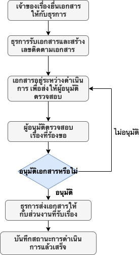

#  Document Tracking: ระบบติดตามงานเอกสาร

## 📘 About Document Tracking

 Document Tracking คือ เว็บที่ใช้ในการติดตามและตรวจสอบขั้นตอนการดำเนินการของเอกสาร โดยได้ออกแบบระบบนี้ขึ้นมาเพื่อลดปัญหาด้านความยุ่งยากในการตรวจสอบ และลดปัญหาในการติดต่อสื่อสาร สามารถติดตามเอกสารว่าอยู่ในลำดับไหนของการพิจารณาอนุมัติ หรือ เอกสารอยู่ในขั้นตอนไหนของการปฏิบัติงาน หรืออยู่ระหว่างการดำเนินการที่ส่วนงานไหน

## 📦 Built With

- [x] Node.js v12.16.3
- [x] React v16.12.0
- [x] Express v4.17.1
- [x] MySQL v8.0.18

****
## ⚒ Work Flow

